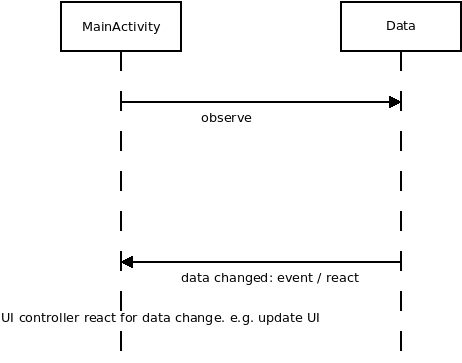

# LiveData
* _an observable data holder class that is lifecycle-aware_
* introduced ~ 2017
* used in combination with ViewModel
* also in package `androidx.lifecycle` like ViewModel, part of Android JetPack
* an Observer Pattern in Android
* attributes / field in a ViewModel (layout bind) can be set as LiveData types
* reactive programming like light RxJava: when data in ViewModel changed (= event) then the data is informed to UI controller (activity/fragment)

## Example
* the example code demonstrates how to react on data changes
* there is no ViewModel, only LiveData

