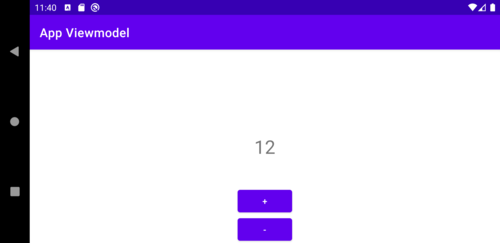

# ViewModel example
* `ViewModel` holds our UI-related data through the hole app lifecycle
* very _basic_ example of `ViewModel` usage
* in general _each_ screen has a `ViewModel`
* with out ViewModel we need to care ourself for the state of our value
* ensure to add dependency to you gradle file
```
//ViewModel
implementation 'androidx.lifecycle:lifecycle-extensions:2.2.0'
```
* check the commit history for code change: 
    * create empty project
    * logic implementation _without_ ViewModel
    * implementation _with_ ViewModel


