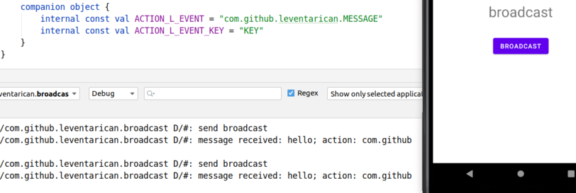

# Broadcast
* __publish-subscribe__ design pattern
* send / receive messages from android system or android apps
* it can be used as a __messaging system__

## Manifest declared receiver
* specify `<receiver />` element in manifest
* implement subclass of `BroadcastReceiver`
* you can do this manual steps also with the IDE: new > other > broadcast receiver
* `AIRPLANE_MODE` wont work with manifest declaration. check links.  

## Context registered receiver
* alternative way to create a receiver. check the link.

## Links
* https://developer.android.com/guide/components/broadcasts
* https://developer.android.com/guide/components/broadcast-exceptions
